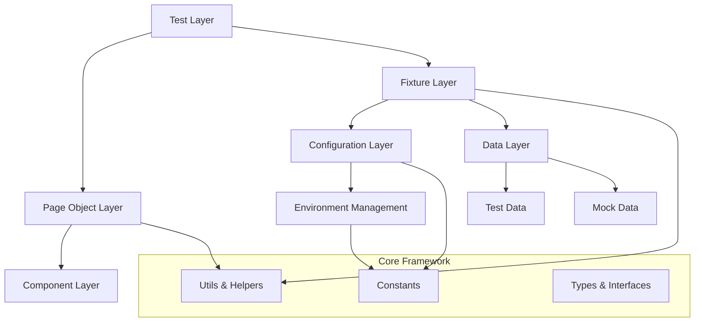
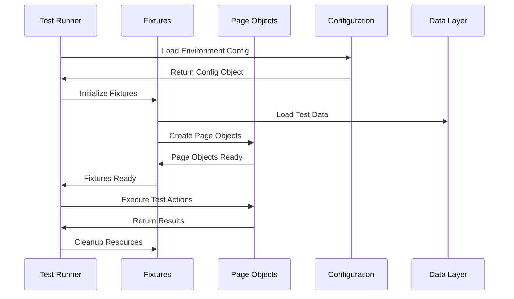
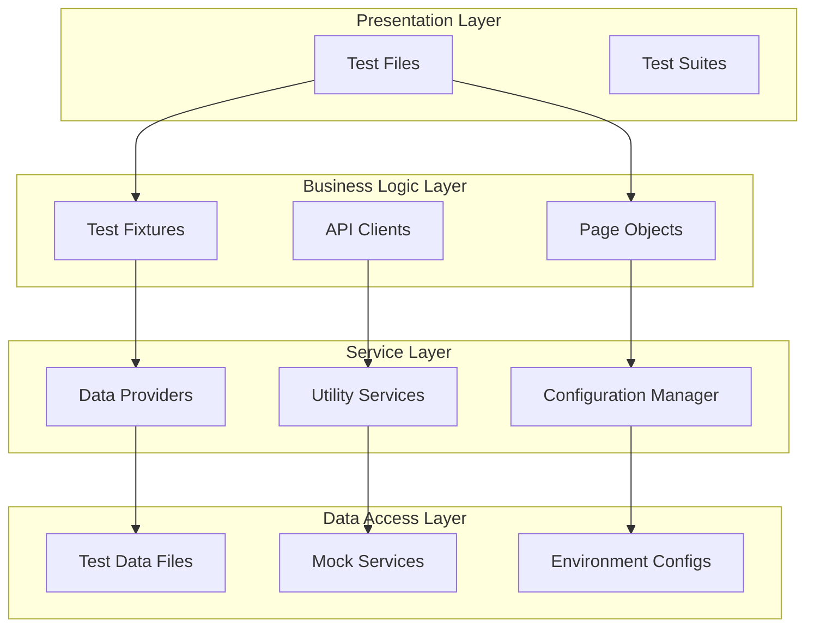
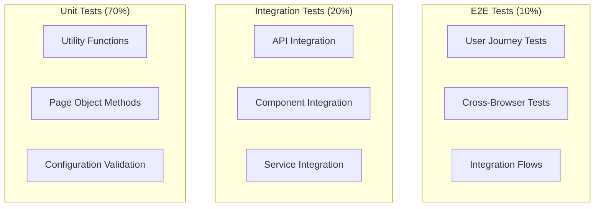

# 🏗️ Framework Architecture Documentation

## 📋 Table of Contents

1. [Architecture Overview](#architecture-overview)
2. [Design Principles](#design-principles)
3. [Core Components](#core-components)
4. [Data Flow](#data-flow)
5. [Layer Architecture](#layer-architecture)
6. [Testing Strategy](#testing-strategy)
7. [Scalability & Performance](#scalability--performance)

---

## 🎯 Architecture Overview

The E2E Playwright Framework follows a **modular, layered architecture**
designed for enterprise-scale testing. The framework is built around the
following architectural patterns:

### 🏛️ Architectural Patterns



### 🎨 Design Philosophy

- **🔒 Type Safety First**: Every component is fully typed with TypeScript
- **📦 Modular Design**: Loosely coupled, highly cohesive components
- **🌍 Environment Agnostic**: Seamless deployment across environments
- **⚡ Performance Optimized**: Built for speed and efficiency
- **🧪 Test-Driven**: Framework components are thoroughly tested
- **📚 Developer Experience**: IntelliSense, auto-completion, and clear APIs

---

## 🎯 Design Principles

### 1. **Single Responsibility Principle (SRP)**

Each component has a single, well-defined purpose:

- Page Objects handle UI interactions
- Fixtures manage test setup/teardown
- Configuration manages environment settings
- Utilities provide helper functions

### 2. **Don't Repeat Yourself (DRY)**

- Centralized constants and configuration
- Reusable page components
- Shared utilities and helpers
- Common test patterns

### 3. **Open/Closed Principle**

- Easy to extend with new page objects
- Plugin-based configuration system
- Extensible fixture architecture
- Customizable test runners

### 4. **Dependency Inversion**

- High-level modules depend on abstractions
- Environment-specific implementations
- Configurable service providers
- Injectable dependencies

---

## 🧩 Core Components

### 📁 Component Overview

```typescript
interface FrameworkComponents {
  // Test Execution Layer
  tests: {
    web: WebTestSuite;
    api: ApiTestSuite;
    e2e: E2ETestSuite;
    integration: IntegrationTestSuite;
  };

  // Page Object Layer
  pages: {
    webPages: PageObjectCollection;
    components: UIComponentCollection;
  };

  // Fixture Layer
  fixtures: {
    webFixtures: WebTestFixtures;
    apiFixtures: ApiTestFixtures;
    dataFixtures: TestDataFixtures;
  };

  // Configuration Layer
  configuration: {
    environments: EnvironmentConfigManager;
    constants: FrameworkConstants;
    types: TypeDefinitions;
  };

  // Utility Layer
  utilities: {
    helpers: UtilityFunctions;
    reporters: TestReporters;
    validators: DataValidators;
  };
}
```

### 🎯 Component Responsibilities

#### **Test Layer** (`tests/`)

- **Purpose**: Contains all test files organized by type and scope
- **Structure**: Hierarchical organization (web/api → feature → test type)
- **Responsibility**: Test logic, assertions, and test scenario orchestration

#### **Page Object Layer** (`src/pages/`)

- **Purpose**: Encapsulates UI elements and interactions
- **Pattern**: Page Object Model with component composition
- **Responsibility**: UI abstraction, element location, user interactions

#### **Fixture Layer** (`src/fixtures/`)

- **Purpose**: Test setup, teardown, and dependency injection
- **Pattern**: Playwright fixture extension pattern
- **Responsibility**: Test context creation, resource management

#### **Configuration Layer** (`config/`)

- **Purpose**: Environment management and framework configuration
- **Pattern**: Strategy pattern for environment-specific settings
- **Responsibility**: Environment detection, configuration resolution

#### **Data Layer** (`data/`)

- **Purpose**: Test data management and mock services
- **Pattern**: Factory pattern for data generation
- **Responsibility**: Test data provisioning, mock data management

---

## 🔄 Data Flow

### 📊 Test Execution Flow



### 🎭 Fixture Lifecycle

1. **Pre-Setup**: Environment detection and configuration loading
2. **Setup**: Fixture initialization and dependency injection
3. **Execution**: Test execution with provided fixtures
4. **Teardown**: Resource cleanup and artifact collection
5. **Post-Teardown**: Report generation and metrics collection

---

## 🏗️ Layer Architecture

### 🎯 Layered Design



### 📋 Layer Responsibilities

#### **Presentation Layer**

- Test orchestration and execution
- Test scenario definition
- Assertion and verification logic
- Test reporting and results

#### **Business Logic Layer**

- UI interaction abstractions
- API communication handling
- Test context management
- Resource lifecycle management

#### **Service Layer**

- Configuration resolution
- Data transformation and validation
- Utility function provisioning
- Cross-cutting concerns

#### **Data Access Layer**

- Static test data storage
- Mock data generation
- Environment configuration
- External service integration

---

## 🧪 Testing Strategy

### 🎯 Testing Pyramid Implementation



### 📊 Test Categories

#### **🔥 Smoke Tests**

- **Purpose**: Quick validation of core functionality
- **Scope**: Critical user paths and basic functionality
- **Execution**: Every deployment, fast feedback
- **Coverage**: Essential features only

#### **🧪 Functional Tests**

- **Purpose**: Feature-specific behavior validation
- **Scope**: Individual features and components
- **Execution**: Feature development and regression
- **Coverage**: Complete feature sets

#### **🔗 Integration Tests**

- **Purpose**: Component interaction validation
- **Scope**: API integrations, service communication
- **Execution**: Integration points and data flow
- **Coverage**: Inter-service communication

#### **🌐 E2E Tests**

- **Purpose**: Complete user journey validation
- **Scope**: End-to-end business workflows
- **Execution**: Release validation and critical paths
- **Coverage**: Complete user scenarios

#### **📋 Contract Tests**

- **Purpose**: API contract and schema validation
- **Scope**: API request/response structures
- **Execution**: API changes and schema evolution
- **Coverage**: API interfaces and data contracts

---

## ⚡ Scalability & Performance

### 🚀 Performance Optimizations

#### **🔄 Parallel Execution**

```typescript
// Dynamic worker calculation based on system resources
const optimalWorkers = Math.min(
  Math.floor(os.cpus().length * 0.75),
  Math.floor(os.totalmem() / (2 * 1024 * 1024 * 1024)),
);
```

#### **🎯 Smart Test Distribution**

- Test sharding based on execution time
- Browser-specific test parallelization
- Environment-aware resource allocation
- Dynamic load balancing

#### **💾 Resource Management**

- Lazy loading of page objects
- Connection pooling for API tests
- Memory-efficient test data handling
- Artifact cleanup automation

### 📈 Scalability Features

#### **🌍 Multi-Environment Support**

- Environment-specific configuration
- Automatic environment detection
- Seamless environment switching
- Environment-aware test execution

#### **📦 Modular Architecture**

- Plugin-based extension system
- Component-based page objects
- Configurable test runners
- Extensible reporting system

#### **🔧 Configuration Management**

- Centralized configuration system
- Environment variable support
- Runtime configuration override
- Configuration validation

---

## 🛠️ Framework Extension Points

### 🔌 Extension Mechanisms

#### **Custom Page Objects**

```typescript
// Extend base page object
export class CustomPage extends BasePage {
  constructor(page: Page) {
    super(page);
  }

  // Custom functionality
  async customAction(): Promise<void> {
    // Implementation
  }
}
```

#### **Custom Fixtures**

```typescript
// Create custom fixtures
export const customTest = base.extend<CustomFixtures>({
  customFixture: async ({}, use) => {
    // Setup custom fixture
    await use(customImplementation);
  },
});
```

#### **Custom Utilities**

```typescript
// Add utility functions
export class CustomUtility {
  static customHelper(data: any): any {
    // Custom logic
    return processedData;
  }
}
```

---

## 📚 Best Practices & Guidelines

### ✅ Development Guidelines

1. **Type Safety**: Always use TypeScript types and interfaces
2. **Code Organization**: Follow the established folder structure
3. **Naming Conventions**: Use descriptive, consistent naming
4. **Documentation**: Document all public APIs and complex logic
5. **Testing**: Test framework components and utilities
6. **Performance**: Consider performance implications of changes

### 🚫 Anti-Patterns to Avoid

1. **Hard-coded Values**: Use configuration and constants
2. **Tight Coupling**: Maintain loose coupling between components
3. **Large Page Objects**: Break down into smaller, focused components
4. **Test Dependencies**: Avoid inter-test dependencies
5. **Resource Leaks**: Always clean up resources in teardown

---

## 🔄 Continuous Improvement

### 📊 Metrics & Monitoring

- Test execution time tracking
- Resource utilization monitoring
- Test stability metrics
- Framework adoption analytics

### 🔧 Maintenance Strategy

- Regular dependency updates
- Performance optimization reviews
- Architecture pattern evolution
- Community feedback integration

This architecture documentation serves as the foundation for understanding and
extending the E2E Playwright Framework. For specific implementation details,
refer to the individual component documentation files.
