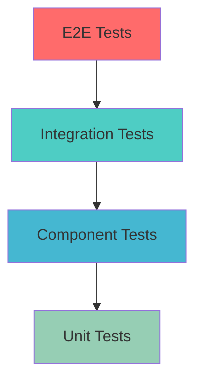

# 🧪 Testing Strategy and Best Practices

## 🎯 Overview

This document outlines the comprehensive testing strategy for the E2E Playwright
Framework, including test categorization, execution strategies, best practices,
and quality assurance guidelines.

## 📋 Table of Contents

1. [Test Pyramid Strategy](#test-pyramid-strategy)
2. [Test Categories](#test-categories)
3. [Execution Strategies](#execution-strategies)
4. [Quality Assurance](#quality-assurance)
5. [CI/CD Integration](#cicd-integration)
6. [Performance Testing](#performance-testing)
7. [Best Practices](#best-practices)

---

## 🏗️ Test Pyramid Strategy

### **Framework Test Architecture**

The framework implements a comprehensive test pyramid strategy to ensure optimal
test coverage, execution speed, and maintenance efficiency.



#### **Test Distribution Strategy**

| Test Level            | Coverage | Execution Speed | Maintenance | Framework Location                                 |
| --------------------- | -------- | --------------- | ----------- | -------------------------------------------------- |
| **Unit Tests**        | 70%      | ⚡ Fastest      | 🟢 Low      | `tests/unit/`                                      |
| **Component Tests**   | 20%      | 🚀 Fast         | 🟡 Medium   | `tests/web/validation/`                            |
| **Integration Tests** | 8%       | 🏃 Medium       | 🟡 Medium   | `tests/web/integration/`, `tests/api/integration/` |
| **E2E Tests**         | 2%       | 🚶 Slow         | 🔴 High     | `tests/web/e2e/`                                   |

#### **Strategic Benefits**

- **Fast Feedback**: Unit tests provide immediate feedback
- **Reliable Coverage**: Integration tests validate component interaction
- **User Journey Validation**: E2E tests ensure complete workflows
- **Cost Efficiency**: Pyramid structure minimizes execution time and
  maintenance

---

## 📊 Test Categories

### **Web Testing Categories**

#### **🚀 Smoke Tests** (`tests/web/smoke/`)

**Purpose**: Validate core functionality and system availability

```typescript
// Example: Login smoke test
test.describe('Login Smoke Tests', () => {
  test('should login with valid credentials', async ({
    loginPage,
    inventoryPage,
    baseUrl,
  }) => {
    await loginPage.navigateToLoginPage(baseUrl);
    await loginPage.login(SAUCEDEMO_USERS.STANDARD_USER);
    await inventoryPage.validateInventoryPageLoad();
  });

  test('should display error for invalid credentials', async ({
    loginPage,
    baseUrl,
  }) => {
    await loginPage.navigateToLoginPage(baseUrl);
    await loginPage.login(SAUCEDEMO_USERS.INVALID_USER);
    await loginPage.validateLoginError('Username and password do not match');
  });
});
```

**Characteristics**:

- ✅ Fast execution (< 2 minutes)
- ✅ Critical path validation
- ✅ Run on every commit
- ✅ Immediate failure notification

#### **🔄 Integration Tests** (`tests/web/integration/`)

**Purpose**: Validate component interactions and data flow

```typescript
// Example: Shopping cart integration
test.describe('Shopping Cart Integration', () => {
  test('should maintain cart state across pages', async ({
    authenticatedPage,
    inventoryPage,
    cartPage,
  }) => {
    // Add products from inventory
    await inventoryPage.addProductToCart(SAUCEDEMO_PRODUCTS.BACKPACK);
    await inventoryPage.addProductToCart(SAUCEDEMO_PRODUCTS.BIKE_LIGHT);

    // Navigate to cart and validate
    await inventoryPage.navigateToCart();
    await cartPage.validateCartItems([
      SAUCEDEMO_PRODUCTS.BACKPACK,
      SAUCEDEMO_PRODUCTS.BIKE_LIGHT,
    ]);
  });
});
```

**Characteristics**:

- ✅ Component interaction validation
- ✅ State management verification
- ✅ Cross-page data persistence
- ✅ Business logic validation

#### **🎭 End-to-End Tests** (`tests/web/e2e/`)

**Purpose**: Validate complete user journeys and workflows

```typescript
// Example: Complete purchase journey
test.describe('Complete User Journey', () => {
  test('should complete full shopping and checkout process', async ({
    loginPage,
    inventoryPage,
    cartPage,
    checkoutPage,
    baseUrl,
  }) => {
    // Authentication
    await loginPage.navigateToLoginPage(baseUrl);
    await loginPage.login(SAUCEDEMO_USERS.STANDARD_USER);

    // Product selection
    await inventoryPage.validateInventoryPageLoad();
    await inventoryPage.addProductToCart(SAUCEDEMO_PRODUCTS.BACKPACK);

    // Cart management
    await inventoryPage.navigateToCart();
    await cartPage.validateCartItems([SAUCEDEMO_PRODUCTS.BACKPACK]);
    await cartPage.proceedToCheckout();

    // Checkout completion
    await checkoutPage.fillCheckoutInformation({
      firstName: 'John',
      lastName: 'Doe',
      postalCode: '12345',
    });
    await checkoutPage.completeCheckout();
    await checkoutPage.validateOrderComplete();
  });
});
```

**Characteristics**:

- ✅ Complete workflow validation
- ✅ Real user scenario simulation
- ✅ Cross-functional testing
- ✅ Business value verification

#### **🎨 Visual Regression Tests** (`tests/web/visual/`)

**Purpose**: Detect unintended UI changes and visual bugs

```typescript
// Example: Visual regression testing
test.describe('Visual Regression Tests', () => {
  test('should match login page visual baseline', async ({
    loginPage,
    page,
    baseUrl,
  }) => {
    await loginPage.navigateToLoginPage(baseUrl);
    await expect(page).toHaveScreenshot('login-page.png');
  });

  test('should match product catalog layout', async ({
    authenticatedPage,
    inventoryPage,
  }) => {
    await inventoryPage.validateInventoryPageLoad();
    await expect(inventoryPage.inventoryContainer).toHaveScreenshot(
      'product-catalog.png',
    );
  });
});
```

#### **🎪 Mocked Tests** (`tests/web/mocked/`)

**Purpose**: Test with controlled API responses and external dependencies

```typescript
// Example: API response mocking
test.describe('Mocked API Tests', () => {
  test('should handle API failure gracefully', async ({ page, loginPage }) => {
    // Mock API failure
    await page.route('**/api/auth/login', route => {
      route.fulfill({ status: 500, body: 'Internal Server Error' });
    });

    await loginPage.navigateToLoginPage(baseUrl);
    await loginPage.login(SAUCEDEMO_USERS.STANDARD_USER);
    await loginPage.validateLoginError('Service temporarily unavailable');
  });
});
```

### **API Testing Categories**

#### **⚡ Functional Tests** (`tests/api/functional/`)

**Purpose**: Validate API functionality and business logic

```typescript
// Example: User API functional tests
test.describe('User API Functional Tests', () => {
  test('should create and retrieve user', async ({
    jsonPlaceholderClient,
    schemaValidator,
  }) => {
    // Create user
    const userData = TestDataFactory.generateUser();
    const createResponse = await jsonPlaceholderClient.createUser(userData);
    expect(createResponse.status()).toBe(201);

    const createdUser = await createResponse.json();
    schemaValidator.validateUser(createdUser);

    // Retrieve user
    const getResponse = await jsonPlaceholderClient.getUser(createdUser.id);
    expect(getResponse.status()).toBe(200);

    const retrievedUser = await getResponse.json();
    expect(retrievedUser.name).toBe(userData.name);
  });
});
```

#### **📋 Contract Tests** (`tests/api/contract/`)

**Purpose**: Validate API contracts and schema compliance

```typescript
// Example: API contract validation
test.describe('JSONPlaceholder Contract Tests', () => {
  test('should validate user schema contract', async ({
    jsonPlaceholderClient,
    schemaValidator,
  }) => {
    const response = await jsonPlaceholderClient.getUsers();
    expect(response.status()).toBe(200);

    const users = await response.json();
    expect(Array.isArray(users)).toBe(true);

    // Validate each user against contract
    users.forEach(user => {
      schemaValidator.validateUser(user);
      expect(user).toHaveProperty('id');
      expect(user).toHaveProperty('name');
      expect(user).toHaveProperty('email');
    });
  });
});
```

#### **🔗 Integration Tests** (`tests/api/integration/`)

**Purpose**: Validate API integration with external services

```typescript
// Example: API integration validation
test.describe('API Integration Tests', () => {
  test('should validate user-posts relationship', async ({
    jsonPlaceholderClient,
  }) => {
    // Get user
    const userResponse = await jsonPlaceholderClient.getUser(1);
    const user = await userResponse.json();

    // Get user's posts
    const postsResponse = await jsonPlaceholderClient.getUserPosts(user.id);
    const posts = await postsResponse.json();

    // Validate relationship
    posts.forEach(post => {
      expect(post.userId).toBe(user.id);
    });
  });
});
```

---

## 🚀 Execution Strategies

### **Parallel Execution**

#### **Worker Optimization**

```typescript
// Playwright configuration for optimal performance
export default defineConfig({
  // Dynamic worker calculation
  workers: process.env.CI
    ? EnvironmentConfigManager.calculateOptimalWorkers()
    : Math.max(1, os.cpus().length - 1),

  // Full parallelization
  fullyParallel: true,

  // Test isolation
  forbidOnly: !!process.env.CI,

  // Retry strategy
  retries: process.env.CI ? 2 : 0,
});
```

#### **Sharding Strategy**

```bash
# Horizontal scaling with test sharding
npm run test:e2e -- --shard=1/4  # Shard 1 of 4
npm run test:e2e -- --shard=2/4  # Shard 2 of 4
npm run test:e2e -- --shard=3/4  # Shard 3 of 4
npm run test:e2e -- --shard=4/4  # Shard 4 of 4
```

### **Environment-Specific Execution**

#### **Development Environment**

```typescript
// Development-focused execution
export const developmentConfig: EnvironmentConfig = {
  web: {
    timeout: 30000, // Longer timeouts for debugging
    retries: 0, // No retries for immediate feedback
    headed: true, // Visual debugging
    slowMo: 100, // Slower execution for observation
  },
  features: {
    enableDebugLogs: true,
    enableVideoRecording: true,
    enableTracing: true,
  },
};
```

#### **CI/CD Environment**

```typescript
// CI/CD optimized execution
export const ciConfig: EnvironmentConfig = {
  web: {
    timeout: 15000, // Faster timeouts
    retries: 2, // Retry flaky tests
    headed: false, // Headless execution
    workers: 'auto', // Auto-calculated workers
  },
  features: {
    enableDebugLogs: false,
    enableVideoRecording: false,
    enableTracing: false,
  },
};
```

### **Test Selection Strategies**

#### **Tag-Based Execution**

```typescript
// Test tagging for selective execution
test.describe('Product Management @smoke @regression', () => {
  test('should add product to cart @critical', async ({ inventoryPage }) => {
    // Critical functionality test
  });

  test('should sort products @enhancement', async ({ inventoryPage }) => {
    // Enhancement feature test
  });
});

// Execution commands
// npm run test -- --grep "@smoke"        # Run smoke tests only
// npm run test -- --grep "@critical"     # Run critical tests only
// npm run test -- --grep "@regression"   # Run regression tests
```

#### **Browser-Specific Execution**

```bash
# Cross-browser testing
npm run test:chrome     # Chromium tests
npm run test:firefox    # Firefox tests
npm run test:safari     # WebKit tests
npm run test:mobile     # Mobile browser tests
```

---

## 🏆 Quality Assurance

### **Code Quality Standards**

#### **Test Code Standards**

```typescript
// ✅ Good: Clear, maintainable test structure
test.describe('User Authentication', () => {
  test.beforeEach(async ({ loginPage, baseUrl }) => {
    await loginPage.navigateToLoginPage(baseUrl);
  });

  test('should authenticate valid user', async ({
    loginPage,
    inventoryPage,
  }) => {
    // Given: Valid user credentials
    const credentials = SAUCEDEMO_USERS.STANDARD_USER;

    // When: User attempts to login
    await loginPage.login(credentials);

    // Then: User should be redirected to inventory
    await inventoryPage.validateInventoryPageLoad();
  });
});

// ❌ Bad: Unclear, hard to maintain
test('test login', async ({ page }) => {
  await page.goto('https://saucedemo.com');
  await page.fill('#user-name', 'standard_user');
  await page.fill('#password', 'secret_sauce');
  await page.click('#login-button');
  await expect(page).toHaveURL(/inventory/);
});
```

#### **Page Object Standards**

```typescript
// ✅ Good: Encapsulated, reusable page object
export class LoginPage {
  private readonly usernameInput: Locator;
  private readonly passwordInput: Locator;

  constructor(private page: Page) {
    this.usernameInput = page.locator('[data-test="username"]');
    this.passwordInput = page.locator('[data-test="password"]');
  }

  async login(credentials: UserCredentials): Promise<void> {
    await this.fillCredentials(credentials);
    await this.submitForm();
    await this.validateLoginAttempt();
  }

  private async fillCredentials(credentials: UserCredentials): Promise<void> {
    await this.usernameInput.fill(credentials.username);
    await this.passwordInput.fill(credentials.password);
  }
}
```

### **Test Data Management**

#### **Data Isolation**

```typescript
// ✅ Good: Isolated test data
test.describe('User Management', () => {
  let testUser: UserData;

  test.beforeEach(async () => {
    // Generate unique test data for each test
    testUser = TestDataFactory.generateUser({
      username: `test_user_${Date.now()}`,
    });
  });

  test('should create user', async ({ userService }) => {
    const createdUser = await userService.createUser(testUser);
    expect(createdUser.username).toBe(testUser.username);
  });

  test.afterEach(async ({ userService }) => {
    // Cleanup test data
    if (testUser.id) {
      await userService.deleteUser(testUser.id);
    }
  });
});
```

#### **Data Consistency**

```typescript
// Centralized test data management
export const TEST_DATA = {
  USERS: {
    STANDARD: {
      username: 'standard_user',
      password: 'secret_sauce',
      type: 'standard',
    } as const,
    ADMIN: {
      username: 'admin_user',
      password: 'admin_sauce',
      type: 'admin',
    } as const,
  },
  PRODUCTS: {
    BACKPACK: {
      id: 'sauce-labs-backpack',
      name: 'Sauce Labs Backpack',
      price: 29.99,
    } as const,
  },
} as const;
```

### **Error Handling**

#### **Robust Error Handling**

```typescript
// Comprehensive error handling
export class LoginPage {
  async login(credentials: UserCredentials): Promise<void> {
    try {
      await this.fillCredentials(credentials);
      await this.submitForm();
      await this.waitForNavigation();
    } catch (error) {
      // Capture screenshot on failure
      await this.page.screenshot({
        path: `./test-results/login-failure-${Date.now()}.png`,
      });

      // Log detailed error information
      console.error('Login failed:', {
        credentials: credentials.username,
        url: this.page.url(),
        error: error.message,
      });

      throw new Error(
        `Login failed for user ${credentials.username}: ${error.message}`,
      );
    }
  }
}
```

#### **Retry Logic**

```typescript
// Intelligent retry logic
async function retryOperation<T>(
  operation: () => Promise<T>,
  maxRetries: number = 3,
  delay: number = 1000,
): Promise<T> {
  for (let attempt = 1; attempt <= maxRetries; attempt++) {
    try {
      return await operation();
    } catch (error) {
      if (attempt === maxRetries) {
        throw error;
      }

      console.warn(`Attempt ${attempt} failed, retrying in ${delay}ms`);
      await new Promise(resolve => setTimeout(resolve, delay));
    }
  }

  throw new Error('All retry attempts failed');
}
```

---

## 🔄 CI/CD Integration

### **Pipeline Configuration**

#### **GitHub Actions Example**

```yaml
name: E2E Test Suite

on:
  push:
    branches: [main, develop]
  pull_request:
    branches: [main]

jobs:
  smoke-tests:
    runs-on: ubuntu-latest
    steps:
      - uses: actions/checkout@v3
      - uses: actions/setup-node@v3
        with:
          node-version: '18'

      - name: Install dependencies
        run: npm ci

      - name: Install Playwright
        run: npx playwright install --with-deps

      - name: Run smoke tests
        run: npm run test:smoke
        env:
          TEST_ENV: ci

      - name: Upload test results
        uses: actions/upload-artifact@v3
        if: failure()
        with:
          name: smoke-test-results
          path: test-results/

  regression-tests:
    runs-on: ubuntu-latest
    needs: smoke-tests
    strategy:
      matrix:
        shard: [1, 2, 3, 4]
    steps:
      - uses: actions/checkout@v3
      - uses: actions/setup-node@v3
        with:
          node-version: '18'

      - name: Install dependencies
        run: npm ci

      - name: Install Playwright
        run: npx playwright install --with-deps

      - name: Run regression tests
        run: npm run test:regression -- --shard=${{ matrix.shard }}/4
        env:
          TEST_ENV: ci

      - name: Upload test results
        uses: actions/upload-artifact@v3
        if: always()
        with:
          name: regression-test-results-${{ matrix.shard }}
          path: test-results/
```

#### **Test Reporting Integration**

```typescript
// Custom reporter for CI/CD integration
export class CIReporter implements Reporter {
  onTestEnd(test: TestCase, result: TestResult): void {
    if (result.status === 'failed') {
      // Send failure notification
      this.notifyFailure(test, result);
    }

    // Collect metrics
    this.collectMetrics(test, result);
  }

  onEnd(result: FullResult): void {
    // Generate comprehensive report
    const report = this.generateReport(result);

    // Upload to external services
    this.uploadToTestRail(report);
    this.updateJiraTickets(report);
  }

  private notifyFailure(test: TestCase, result: TestResult): void {
    // Slack notification
    this.sendSlackNotification({
      channel: '#test-failures',
      message: `Test failed: ${test.title}`,
      error: result.error?.message,
    });
  }
}
```

### **Quality Gates**

#### **Automated Quality Checks**

```typescript
// Quality gate configuration
interface QualityGates {
  testCoverage: {
    minimum: number; // Minimum test coverage %
    trend: 'improving' | 'stable'; // Coverage trend requirement
  };
  performanceMetrics: {
    maxExecutionTime: number; // Maximum test suite execution time
    maxFailureRate: number; // Maximum acceptable failure rate
  };
  codeQuality: {
    lintingErrors: number; // Maximum linting errors
    complexityScore: number; // Maximum complexity score
  };
}

const QUALITY_GATES: QualityGates = {
  testCoverage: {
    minimum: 80,
    trend: 'stable',
  },
  performanceMetrics: {
    maxExecutionTime: 300000, // 5 minutes
    maxFailureRate: 0.05, // 5%
  },
  codeQuality: {
    lintingErrors: 0,
    complexityScore: 10,
  },
};
```

---

## ⚡ Performance Testing

### **Performance Benchmarks**

#### **Response Time Benchmarks**

```typescript
interface PerformanceBenchmarks {
  pageLoad: number; // Page load time
  apiResponse: number; // API response time
  userAction: number; // User interaction time
  testExecution: number; // Test execution time
}

const PERFORMANCE_BENCHMARKS: PerformanceBenchmarks = {
  pageLoad: 3000, // 3 seconds
  apiResponse: 2000, // 2 seconds
  userAction: 1000, // 1 second
  testExecution: 30000, // 30 seconds per test
};

// Performance validation in tests
test('page load performance', async ({ loginPage, performanceTracker }) => {
  const timer = performanceTracker.startTimer('page-load');
  await loginPage.navigateToLoginPage(baseUrl);
  timer();

  const metrics = performanceTracker.getMetric('page-load');
  expect(metrics.duration).toBeLessThan(PERFORMANCE_BENCHMARKS.pageLoad);
});
```

#### **Resource Monitoring**

```typescript
class ResourceMonitor {
  static async monitorPageLoad(page: Page): Promise<PerformanceMetrics> {
    const metrics = await page.evaluate(() => {
      const navigation = performance.getEntriesByType(
        'navigation',
      )[0] as PerformanceNavigationTiming;
      const paint = performance.getEntriesByType('paint');

      return {
        domContentLoaded:
          navigation.domContentLoadedEventEnd - navigation.navigationStart,
        loadComplete: navigation.loadEventEnd - navigation.navigationStart,
        firstPaint: paint.find(p => p.name === 'first-paint')?.startTime || 0,
        firstContentfulPaint:
          paint.find(p => p.name === 'first-contentful-paint')?.startTime || 0,
      };
    });

    return metrics;
  }
}
```

---

## 📝 Best Practices

### **Test Writing Guidelines**

#### **Test Structure**

```typescript
// ✅ Good: Clear test structure with Given-When-Then
test.describe('Shopping Cart Functionality', () => {
  test('should add product to cart and update count', async ({
    authenticatedPage,
    inventoryPage,
    cartPage,
  }) => {
    // Given: User is on inventory page
    await inventoryPage.validateInventoryPageLoad();

    // When: User adds product to cart
    await inventoryPage.addProductToCart(SAUCEDEMO_PRODUCTS.BACKPACK);

    // Then: Cart count should update
    await inventoryPage.validateCartItemCount(1);

    // And: Product should be in cart
    await inventoryPage.navigateToCart();
    await cartPage.validateCartContainsProduct(SAUCEDEMO_PRODUCTS.BACKPACK);
  });
});
```

#### **Test Independence**

```typescript
// ✅ Good: Independent, isolated tests
test.describe('User Authentication', () => {
  test.beforeEach(async ({ loginPage, baseUrl }) => {
    // Fresh state for each test
    await loginPage.navigateToLoginPage(baseUrl);
  });

  test('valid login', async ({ loginPage }) => {
    // Test only login functionality
    await loginPage.login(SAUCEDEMO_USERS.STANDARD_USER);
    await loginPage.validateSuccessfulLogin();
  });

  test('invalid login', async ({ loginPage }) => {
    // Independent test for error case
    await loginPage.login(SAUCEDEMO_USERS.INVALID_USER);
    await loginPage.validateLoginError('Username and password do not match');
  });
});
```

#### **Error Messages and Debugging**

```typescript
// ✅ Good: Descriptive error messages
async validateCartItemCount(expectedCount: number): Promise<void> {
  const actualCount = await this.getCartItemCount();

  if (actualCount !== expectedCount) {
    // Capture state for debugging
    const cartItems = await this.getCartItems();

    throw new Error(
      `Cart item count mismatch. Expected: ${expectedCount}, Actual: ${actualCount}\n` +
      `Current cart items: ${JSON.stringify(cartItems, null, 2)}\n` +
      `Page URL: ${this.page.url()}`
    );
  }
}
```

### **Maintenance Guidelines**

#### **Regular Maintenance Tasks**

1. **Weekly Reviews**
   - Review failing tests and flaky test patterns
   - Update test data and clean up obsolete data
   - Performance metrics analysis

2. **Monthly Maintenance**
   - Framework dependency updates
   - Test coverage analysis and improvement
   - Documentation updates

3. **Quarterly Reviews**
   - Architecture review and optimization
   - Tool evaluation and potential upgrades
   - Training and knowledge sharing sessions

#### **Test Health Monitoring**

```typescript
// Test health metrics collection
interface TestHealthMetrics {
  flakyTests: string[]; // Tests with inconsistent results
  slowTests: string[]; // Tests exceeding time thresholds
  failurePatterns: string[]; // Common failure patterns
  coverageGaps: string[]; // Areas lacking test coverage
}

class TestHealthMonitor {
  static analyzeTestRuns(results: TestResult[]): TestHealthMetrics {
    return {
      flakyTests: this.identifyFlakyTests(results),
      slowTests: this.identifySlowTests(results),
      failurePatterns: this.analyzeFailurePatterns(results),
      coverageGaps: this.identifyCoverageGaps(results),
    };
  }
}
```

This comprehensive testing strategy ensures robust, maintainable, and efficient
test automation that scales with project growth and provides reliable feedback
for continuous delivery.
